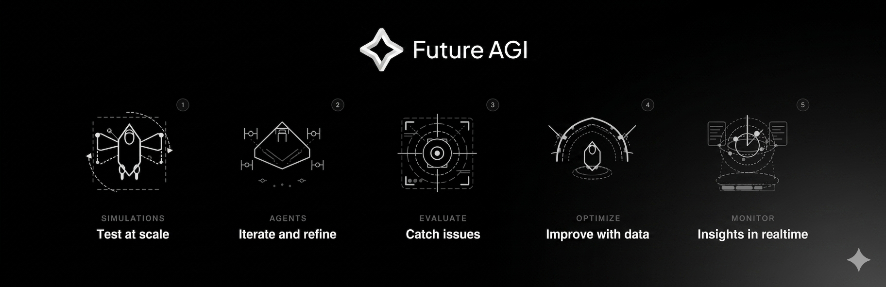

<div align="center">

# Simulate — test AI agents before users meet them

**Python SDK for the `Simulate` pillar of [Future AGI](https://github.com/future-agi/future-agi).**
Run voice and text agents against persona-driven scenarios, capture transcripts and audio, and feed results straight into evals.

<p>
  <a href="https://pypi.org/project/agent-simulate/"></a>
  <a href="https://pypi.org/project/agent-simulate/"></a>
  <a href="https://github.com/future-agi/simulate-sdk/blob/main/LICENSE"></a>
  <a href="https://pypi.org/project/agent-simulate/"></a>
  <a href="https://discord.gg/UjZ2gRT5p"></a>
</p>

<p>
  <a href="https://pypi.org/project/agent-simulate/"><b>PyPI</b></a> ·
  <a href="https://docs.futureagi.com/docs/simulation"><b>Docs</b></a> ·
  <a href="https://app.futureagi.com"><b>Platform</b></a> ·
  <a href="https://github.com/future-agi/future-agi"><b>Main repo</b></a> ·
  <a href="https://discord.gg/UjZ2gRT5p"><b>Discord</b></a> ·
  <a href="https://github.com/future-agi/simulate-sdk/issues"><b>Issues</b></a>
</p>

</div>

---

## Why this SDK?

AI agents hallucinate. They fabricate facts and misquote policies, and a bad output in production is already in the world by the time anyone notices. You can't unit-test "don't make things up" — you run the agent against realistic conversations before real users do.

`agent-simulate` is the client SDK for the `Simulate` pillar of Future AGI. It drives voice and text agents through persona-driven scenarios and hands the transcripts + audio to the `Evaluate` pillar for scoring.

---

<div align="center">
  
</div>

## What's in the box

<table>
<tr>
<td width="33%" valign="top">

### Voice agents (LiveKit)

Connect a simulated customer to an agent sitting in a **LiveKit** room over WebRTC. Full multi-turn conversation, **per-speaker and combined WAV recordings**, and a complete transcript.

</td>
<td width="33%" valign="top">

### Text agents (Cloud)

Orchestrate thousands of multi-turn text conversations against any agent framework (**OpenAI**, **Anthropic**, **LangChain**, **Gemini**, or your own), via Future AGI's hosted simulation backend.

</td>
<td width="33%" valign="top">

### Evaluation-ready

Results drop straight into [`ai-evaluation`](https://github.com/future-agi/ai-evaluation) via the `evaluate_report` helper. Score with **50+ built-in metrics** or your own rubrics — task completion, tone, audio quality, groundedness, and others.

</td>
</tr>
</table>

---

## Install

```bash
# Core SDK
pip install agent-simulate

# With voice (LiveKit) support
pip install "agent-simulate[livekit]"

# With evaluation helpers
pip install "agent-simulate[evaluation]"

# Everything
pip install "agent-simulate[all]"
```

Requires Python **3.10–3.13**.

<details>
<summary><b>Voice mode: download Silero VAD weights (one time)</b></summary>

The LiveKit engine uses Silero VAD for voice-activity detection. Run this once after installing the `[livekit]` extra:

```python
from livekit.plugins import silero

if __name__ == "__main__":
    silero.VAD.load()
```

</details>

---

## 🚀 Quickstart — Voice agent (LiveKit)

Connects a simulated customer (`Alice`) to a deployed voice agent waiting in a LiveKit room, records the call, and scores the transcript.

```python
import asyncio
import os
from dotenv import load_dotenv
from fi.simulate import AgentDefinition, Scenario, Persona, TestRunner
from fi.simulate.evaluation import evaluate_report

load_dotenv()

async def main():
    # 1. Point at your deployed voice agent
    agent = AgentDefinition(
        name="my-support-agent",
        url=os.environ["LIVEKIT_URL"],
        room_name="support-room",
        system_prompt="Helpful support agent",
    )

    # 2. Describe the test case
    scenario = Scenario(
        name="Password Reset",
        dataset=[
            Persona(
                persona={"name": "Alice", "mood": "frustrated"},
                situation="She cannot log into her account.",
                outcome="The agent should guide her through a password reset.",
            ),
        ],
    )

    # 3. Run the simulation
    runner = TestRunner()
    report = await runner.run_test(
        agent_definition=agent,
        scenario=scenario,
        record_audio=True,  # writes per-speaker + combined WAVs
    )

    # 4. Inspect results
    for r in report.results:
        print(r.transcript)
        print(r.audio_combined_path)

    # 5. Score with Future AGI evals
    evaluated = evaluate_report(
        report,
        eval_specs=[
            {"template": "task_completion",
             "map": {"input": "persona.situation", "output": "transcript"}},
            {"template": "audio_quality",
             "map": {"input_audio": "audio_combined_path"}},
        ],
    )

    for r in evaluated.results:
        for name, scores in (r.evaluation or {}).items():
            print(name, scores["score"], scores["reason"])

asyncio.run(main())
```

**Required environment variables** (voice mode):

```bash
LIVEKIT_URL="wss://your-livekit-server.com"
LIVEKIT_API_KEY="..."
LIVEKIT_API_SECRET="..."
OPENAI_API_KEY="..."           # for the simulated customer
FI_API_KEY="..."               # for evaluation
FI_SECRET_KEY="..."
```

---

## 🚀 Quickstart — Text agent (Cloud)

Cloud mode runs the scenario orchestration on Future AGI's backend and calls **your** agent over a local callback. Use it when you want thousands of parallel text conversations against an OpenAI, Anthropic, LangChain, or Gemini agent without running LiveKit.

1. Create a simulation run from the [Future AGI platform](https://app.futureagi.com) and copy its `run_id` (or name).
2. Wire your agent to the runner:

```python
import asyncio
import os
from openai import AsyncOpenAI
from fi.simulate import TestRunner, OpenAIAgentWrapper

async def main():
    # Your agent, wrapped in a zero-config adapter
    wrapper = OpenAIAgentWrapper(
        client=AsyncOpenAI(),
        model="gpt-4o-mini",
        system_prompt="You are a helpful support agent.",
    )

    runner = TestRunner(
        api_key=os.environ["FI_API_KEY"],
        secret_key=os.environ["FI_SECRET_KEY"],
    )

    report = await runner.run_test(
        run_test_name="support-agent-smoke-test",  # or run_id="..."
        agent_callback=wrapper,
        concurrency=5,
    )

asyncio.run(main())
```

Scores and transcripts land in the platform dashboard. The local `TestReport` is intentionally empty — metrics live in the backend so you can compare runs over time.

<sub>See [`examples/test_cloud_simulation.py`](examples/test_cloud_simulation.py) for a full tool-using walkthrough. That example shows a custom `AgentWrapper` subclass around the [OpenAI Agents SDK](https://github.com/openai/openai-agents-python) — useful when you need tool-call capture beyond the built-in `OpenAIAgentWrapper`.</sub>

---

## Agent wrappers

Built-in adapters for common SDKs plus a framework-neutral adapter layer. The generic adapter carries normalized messages, tools, memory, events, and multimodal artifacts, so the same report shape works for text, voice, image, browser/CUA, and framework-specific runtimes.

| Wrapper | Wraps | Import |
|---|---|---|
| `OpenAIAgentWrapper` | `openai.OpenAI` / `AsyncOpenAI` (chat.completions) | `from fi.simulate import OpenAIAgentWrapper` |
| `AnthropicAgentWrapper` | `anthropic.Anthropic` / `AsyncAnthropic` | `from fi.simulate import AnthropicAgentWrapper` |
| `GeminiAgentWrapper` | `google.generativeai.GenerativeModel` | `from fi.simulate import GeminiAgentWrapper` |
| `LangChainAgentWrapper` | Any LangChain `Runnable` / chain | `from fi.simulate import LangChainAgentWrapper` |
| `GenericAgentWrapper` / `wrap_agent` | Any callable/object with `call`, `ainvoke`, `invoke`, `run`, `send`, `respond`, or `chat` | `from fi.simulate import wrap_agent` |
| `wrap_framework` | Import-free presets for LangChain, LangGraph, CrewAI, AutoGen, LlamaIndex, OpenAI Agents, LiveKit, Pipecat, browser/CUA, vision agents, and more | `from fi.simulate import wrap_framework` |
| Mock wrappers | Scripted, echo, and rule-based agents for deterministic regression tests | `from fi.simulate import ScriptedAgentWrapper` |
| Custom | Anything — subclass `AgentWrapper` | `from fi.simulate import AgentWrapper` |

Rolling your own wrapper is a 20-line class — see [CONTRIBUTING.md → Adding a new agent wrapper](CONTRIBUTING.md#-adding-a-new-agent-wrapper).

---

## Local self-contained simulation

Use `TestRunner` with `agent_callback` and a `scenario` or `topic` to run locally without LiveKit, Future AGI cloud, or model keys. Reports include transcript, normalized messages, tool calls, artifacts, events, and metadata.

```python
from fi.simulate import SyntheticDataGenerator, TestRunner, wrap_framework

scenario = SyntheticDataGenerator().generate("browser checkout support", seed=11)
agent = wrap_framework("computer_use", browser_agent)

report = await TestRunner().run_test(
    scenario=scenario,
    agent_callback=agent,
    modality="cua",
    max_turns=2,
)

print(report.results[0].messages)
print(report.results[0].artifacts)
print(report.results[0].events)
```

See [`examples/local_multimodal_simulation.py`](examples/local_multimodal_simulation.py) for a full offline browser/CUA-style cookbook.

### Local environments

Use environment adapters when the agent needs a world to act on: mocked APIs,
transient tool/API faults, browser/CUA state, browser mutation packs, voice
turns, image fixtures, files, world contracts/state machines, framework traces,
streaming/session traces, orchestration graph traces, or multi-agent handoffs.
Browser adapters can emit DOM snapshots, screenshots, coordinate-region
assertions, screenshot/action diff evidence, prompt-injection surfaces, action
replay, console/network logs, HAR/resource-body replay, OpenAI Computer Use and
Browser Use trace imports, imported actionability timelines, image-derived
pixel screenshot diffs, semantic/masked visual-diff regions, layout-shift
distributions, storage-state/cookie/localStorage/sessionStorage capture,
runtime events, performance timing, structured browser mutation packs for stale
selectors/storage drift/runtime faults/network latency/overlays, and trace
artifacts.
Voice adapters can replay VAD/STT/TTS
events, Pipecat-style frames, latency profiles, barge-in/overlap handling, call
routing, noise metadata, LiveKit/Pipecat-style export JSON, waveform fixtures,
decoded local WAV/PCM media, speaker diarization segments, perceptual audio
metrics, WebRTC-style jitter and packet-loss counters, audio artifacts,
timelines, and voice trace artifacts.
Framework trace adapters can replay native orchestration spans and event streams
from LangChain/LangGraph, OpenAI Agents, CrewAI, AutoGen, LiveKit, Pipecat, or
custom runtimes. `load_langchain_event_stream` and
`load_langgraph_event_stream` preserve typed `messages`, `tools`, `updates`,
subgraph/node, final-output, and state evidence from stream exports.
`load_autogen_groupchat_transcript`, `load_crewai_event_log`, and
`load_openai_agents_trace` preserve multi-agent speaker, handoff, tool-owner,
turn, and termination evidence from exported framework transcripts.
Orchestration trace adapters project arbitrary runtime records into portable
workflow graph evidence: nodes, edges/routes, steps, retries, recovery,
latency, cost, terminal status, and state.
Streaming trace adapters replay incremental chunks, tool-call deltas,
interruptions, drops/backpressure, first-token latency, inter-chunk gaps, usage,
finalization, and state from LangChain/LangGraph stream modes, OpenAI Agents
stream events, LiveKit session events, Pipecat frames, OpenTelemetry GenAI
attributes, or custom runtimes.
World contract adapters replay portable task state machines with actors,
resources, transitions, pre/postconditions, invariants, success conditions,
policy gates, adversarial surfaces, and final state.
Adversarial packs add hostile retrieved context,
file content, browser DOM, and memory-like context for indirect prompt-injection
tests. The local engine exposes environment tools through `AgentInput.tools`,
auto-executes matching tool calls, and records tool results, per-call
`state_updates`, final environment state, artifacts, and events in the report.
Structured artifact fixtures emit parsed receipts, forms, tables, logs, or
domain JSON as `json` artifacts with deterministic inspection tools, so local
evals can check exact fields, rows, event sequences, and answer claims.
Multi-agent rooms can also carry expected handoffs, review requirements, and
reconciliation requirements so evaluators can score contract correctness instead
of only checking that a handoff trace exists.

```python
from fi.simulate import (
    AdversarialEnvironmentPack,
    AutonomyLoopEnvironment,
    BrowserEnvironment,
    FileEnvironment,
    FrameworkTraceEnvironment,
    ImageEnvironment,
    MultiAgentRoomEnvironment,
    OrchestrationTraceEnvironment,
    RetrievalMemoryEnvironment,
    StreamingTraceEnvironment,
    StructuredArtifactEnvironment,
    ToolFaultInjectionEnvironment,
    ToolMockEnvironment,
    TestRunner,
    VoiceEnvironment,
    WorldContractEnvironment,
    load_adversarial_attack_pack,
    load_browser_mutation_pack,
    load_browser_trace_export,
    load_framework_trace_export,
    load_orchestration_trace_export,
    load_streaming_trace_export,
    load_voice_export,
    load_world_contract,
    load_autogen_groupchat_transcript,
    load_crewai_event_log,
    load_openai_agents_trace,
    load_langchain_event_stream,
    load_langgraph_event_stream,
    normalize_orchestration_trace_events,
    normalize_streaming_trace_events,
    normalize_adversarial_attack_pack,
    normalize_browser_mutation_pack,
    normalize_voice_timing_distribution,
    normalize_world_contract,
    normalize_framework_trace_events,
    normalize_browser_trace_export,
)

report = await TestRunner().run_test(
    scenario=scenario,
    agent_callback=agent,
    environment=[
        ToolFaultInjectionEnvironment({
            "search_order": {"count": 1, "error": "timeout"},
        }),
        ToolMockEnvironment({
            "search_order": lambda args, ctx: {
                "content": "Order is ready",
                "state_updates": {"case": {"resolved": True}},
            }
        }),
        AutonomyLoopEnvironment(
            goal="Resolve the case with observe/orient/plan/act/verify/reflect evidence.",
            expected_plan={"required_steps": ["lookup", "policy", "respond"]},
            expected_verification={"required_checks": ["order found"], "passed_required": True},
            expected_reflection={"required_terms": ["verify", "policy"]},
            expected_memory={"required_keys": ["order_id", "status"]},
            expected_skills=[{"name": "refund_policy_check", "required_steps": ["lookup", "verify"]}],
            expected_stop={"should_stop": True},
        ),
        FrameworkTraceEnvironment(
            framework="openai_agents",
            spans=[
                {"id": "agent_1", "name": "agent_span", "type": "agent"},
                {"id": "tool_1", "name": "function_span search_order", "type": "tool"},
            ],
        ),
        OrchestrationTraceEnvironment(
            framework="langgraph",
            records=[
                {"name": "invoke_workflow refund_graph", "attributes": {"gen_ai.operation.name": "invoke_workflow"}},
                {"name": "handoff triage to policy", "node": "triage_agent", "route_to": "policy_agent"},
                {"name": "policy_agent retry succeeded", "node": "policy_agent", "attempt": 2, "recovered": True},
            ],
            state={"case": {"status": "resolved"}},
        ),
        StreamingTraceEnvironment(
            framework="mixed-realtime",
            events=[
                {"type": "messages", "delta": "Refund ", "latency_ms": 120},
                {"type": "raw_response_event", "tool_call_chunks": [{"name": "lookup_order"}]},
                {"event": "user_interruption_detected"},
                {"event": "agent_false_interruption", "status": "resumed"},
                {"type": "messages", "delta": "approved.", "gap_ms": 18},
                {"event": "response.completed", "status": "completed"},
            ],
            state={"response": {"status": "completed"}},
        ),
        load_langgraph_event_stream({
            "events": [
                {"method": "messages", "params": {"data": {"node": "support_agent", "text": "planning"}}},
                {"method": "tools", "params": {"data": {"tool_name": "search_order"}}},
            ]
        }),
        load_autogen_groupchat_transcript({
            "events": [
                {"type": "TextMessage", "source": "PlanningAgent", "content": "1. WebSearchAgent: search order 123."},
                {"type": "ToolCallRequestEvent", "source": "WebSearchAgent", "content": [{"name": "search_policy"}]},
                {"type": "TextMessage", "source": "DataAnalystAgent", "content": "Policy-compliant. TERMINATE"},
            ]
        }),
        RetrievalMemoryEnvironment({
            "refund_policy_current": {
                "content": "Order 123 can be refunded under the current policy.",
                "version": "v2",
                "current": True,
            }
        }, memory={"order_id": "123"}),
        BrowserEnvironment(
            url="https://shop.example.com/checkout",
            dom="<button id='review'>Review</button>",
            screenshot_uri="file:///fixtures/checkout.png",
            allowed_domains=["shop.example.com"],
            console_logs=[{"level": "info", "message": "checkout loaded"}],
            network_log=[{"url": "https://shop.example.com/api/order", "status": 200}],
        ),
        VoiceEnvironment(
            [{"id": "caller_1", "transcript": "Please check order 123."}],
            routes={"billing": {"kind": "queue", "name": "billing_specialist"}},
            noise_profile={"noise_db": 62, "processed_noise_db": 24},
            frame_replay=[
                {"type": "InputAudioRawFrame", "timestamp_ms": 0},
                {"type": "TranscriptionFrame", "text": "Please check order 123."},
                {"type": "TTSStartedFrame", "timestamp_ms": 650},
                {"type": "TTSAudioRawFrame", "duration_ms": 900},
                {"type": "OverlappingSpeechFrame", "overlap_ms": 180},
            ],
        ),
        ImageEnvironment({
            "receipt": {"uri": "file:///fixtures/receipt.png", "description": "Order receipt"}
        }),
        FileEnvironment({"refund-policy.md": "Refunds require approval."}),
        StructuredArtifactEnvironment({
            "receipt_123": {
                "domain": "receipt",
                "schema": "receipt_v1",
                "data": {"receipt_id": "rcpt_123", "total": {"amount": 42.0}},
            }
        }),
        AdversarialEnvironmentPack(),
        MultiAgentRoomEnvironment(
            ["support_agent", "policy_specialist"],
            handoff_contracts={
                "policy_specialist": {"required_output": "policy decision"}
            },
            expected_handoffs=[
                {"to": "policy_specialist", "context_keys": ["order_id"]}
            ],
            expected_reconciliation={"accepted_source": "policy_specialist"},
        ),
    ],
    max_turns=1,
)
```

Put `ToolFaultInjectionEnvironment` before the real or mocked tool adapter to
fail the first N matching calls, emit structured `tool_fault` and
`tool_execution` events, and then allow later retries to fall through to the
next environment adapter.

For production trace capture, use TraceAI/OpenTelemetry and store/export those
spans through Future AGI or another OTel-compatible backend. The local
`FrameworkTraceEnvironment` can ingest raw TraceAI/OpenTelemetry-style span
records, JSON/JSONL export files, HTTP export URLs with headers, or OTLP
`resourceSpans` payloads directly, or you can normalize them first:

```python
trace_records = normalize_framework_trace_events(
    "traceai",
    [
        {
            "name": "langgraph node support_agent",
            "attributes": {
                "gen_ai.span.kind": "CHAIN",
                "langgraph.state.updates": {"step": "planned"},
            },
        },
        {
            "name": "search_order",
            "attributes": {
                "gen_ai.span.kind": "TOOL",
                "gen_ai.tool.name": "search_order",
            },
        },
    ],
)

environment = FrameworkTraceEnvironment(framework="traceai", events=trace_records)

# Direct export replay also works for OTLP JSON, JSONL, and exported payloads:
environment = load_framework_trace_export("traceai-export.jsonl", framework="traceai")
environment = FrameworkTraceEnvironment.from_export(framework="traceai", export=otlp_payload)

# LangChain/LangGraph stream_events replay:
environment = load_langgraph_event_stream({"events": langgraph_stream_events})

# Framework-neutral streaming/session trace replay:
environment = load_streaming_trace_export({"events": streaming_events})

# Framework-neutral world contract/state-machine replay:
environment = load_world_contract(
    {
        "name": "refund_world",
        "initial_state": {"case": {"status": "open"}},
        "transitions": [{"id": "issue_refund", "effects": {"case.status": "resolved"}}],
    }
)

# Multi-agent framework transcript replay:
environment = load_autogen_groupchat_transcript({"events": autogen_groupchat_events})
environment = load_crewai_event_log("crewai-events.jsonl")
environment = load_openai_agents_trace(openai_agents_spans)
```

See [`examples/local_environment_adapters.py`](examples/local_environment_adapters.py) for a full local world simulation with ai-evaluation scoring, and [`examples/local_voice_image_environments.py`](examples/local_voice_image_environments.py) for a voice + image artifact cookbook.
See [`examples/local_browser_trace_replay.py`](examples/local_browser_trace_replay.py) for a browser/CUA trace replay cookbook with screenshots, DOM, selector and coordinate-region action fixtures, screenshot/action diff evidence, prompt-injection surfaces, mutable browser state, console/network logs, DOM mutation events, and action replay.
See [`examples/local_playwright_trace_replay.py`](examples/local_playwright_trace_replay.py) for a Playwright trace.zip replay cookbook with imported DOM snapshots, screenshots, video artifacts, stale-screenshot refresh, and layout-shift perturbations.
See [`examples/local_browser_cua_trace_replay.py`](examples/local_browser_cua_trace_replay.py) for a HAR + OpenAI Computer Use + Browser Use trace replay cookbook with resource bodies, batched `computer_call.actions[]`, screenshots, safety checks, and imported actionability timeline evidence.
See [`examples/local_browser_visual_fidelity_replay.py`](examples/local_browser_visual_fidelity_replay.py) for a browser/CUA visual-fidelity cookbook with generated PNG fixtures, image-derived pixel diffs, changed-pixel metrics, changed regions, and layout-shift distribution evidence.
See [`examples/local_browser_semantic_visual_diff.py`](examples/local_browser_semantic_visual_diff.py) for a browser/CUA visual-diff cookbook with semantic changed regions, masked dynamic regions, allowed-region checks, and forbidden-region checks.
See [`examples/local_browser_runtime_state_replay.py`](examples/local_browser_runtime_state_replay.py) for a browser/CUA runtime-state cookbook with cookies, localStorage, sessionStorage, page-error events, and performance timing checks.
See [`examples/local_browser_mutation_pack.py`](examples/local_browser_mutation_pack.py) for a browser/CUA mutation-pack cookbook with stale selectors, storage drift, runtime faults, network latency, actionability evidence, and fallback selector scoring.
See [`examples/local_voice_replay_routing.py`](examples/local_voice_replay_routing.py) for a voice replay cookbook with VAD/STT/TTS events, Pipecat-style frame replay, noise/overlap evidence, interruption handling, and call routing.
See [`examples/local_voice_export_replay.py`](examples/local_voice_export_replay.py) for a voice export replay cookbook with LiveKit-style events, Pipecat-style frames, waveform fixtures, diarization, MOS/SNR/clipping/jitter/packet-loss checks, and `load_voice_export`.
See [`examples/local_voice_media_decode.py`](examples/local_voice_media_decode.py) for a self-contained WAV media replay cookbook with decoded sample rate, duration, RMS/peak, and clipping checks.
See [`examples/local_voice_timing_distribution.py`](examples/local_voice_timing_distribution.py) for a voice timing-distribution cookbook with VAD, end-of-utterance, STT, LLM, TTS, and full-turn p95 stage evidence.
See [`examples/local_framework_trace_replay.py`](examples/local_framework_trace_replay.py) for a framework trace replay cookbook with native spans/events and TraceAI/OpenTelemetry export payloads from orchestration frameworks.
See [`examples/local_langgraph_event_stream_replay.py`](examples/local_langgraph_event_stream_replay.py) for a LangGraph/LangChain event-stream replay cookbook with message/tool/state projections and transcript-quality scoring.
See [`examples/local_orchestration_graph_trace.py`](examples/local_orchestration_graph_trace.py) for a framework-neutral workflow graph cookbook with nodes, routes, retries, recovery, latency/cost budgets, terminal status, and state checks.
See [`examples/local_streaming_trace_replay.py`](examples/local_streaming_trace_replay.py) for a framework-neutral streaming/session trace cookbook with chunks, tool deltas, interruption recovery, drops, latency, gaps, usage, finalization, and state checks.
See [`examples/local_world_contract_replay.py`](examples/local_world_contract_replay.py) for a framework-neutral world contract cookbook with actors, resources, transitions, invariants, policy gates, adversarial surfaces, success conditions, and state checks.
See [`examples/local_cross_trial_memory_skill.py`](examples/local_cross_trial_memory_skill.py) for a LangGraph/LangChain-style memory and skill replay cookbook with cross-trial memory precision/recall, recall-after-write, persistence, and skill-regression scoring.
See [`examples/local_multi_agent_framework_transcript.py`](examples/local_multi_agent_framework_transcript.py) for an AutoGen/CrewAI/OpenAI Agents-style multi-agent transcript replay cookbook with speaker, handoff, tool-owner, turn, and termination scoring.
See [`examples/local_retrieval_memory_attribution.py`](examples/local_retrieval_memory_attribution.py) for a retrieval/memory attribution cookbook with queries, ranked documents, retrieval scores, citations, memory reads/writes, and freshness evidence.
See [`examples/local_autonomy_loop_trace.py`](examples/local_autonomy_loop_trace.py) for an autonomy-loop cookbook with observe/orient/plan/act/verify/reflect, feedback, memory, skill-library evidence, and plan/verifier/reflection/memory/skill/stop quality checks.
See [`examples/local_multi_agent_handoff_trace.py`](examples/local_multi_agent_handoff_trace.py) for a multi-agent handoff cookbook with roles, contracts, delegated work, review, reconciliation, trace coverage, and coordination-quality scoring.
See [`examples/local_adversarial_environment_pack.py`](examples/local_adversarial_environment_pack.py) for an indirect prompt-injection pentest using hostile tool, file, browser, and memory surfaces.
See [`examples/local_adversarial_attack_pack.py`](examples/local_adversarial_attack_pack.py) for a structured adversarial attack-pack cookbook with attack cases, canaries, blocked tools, safe-response checks, and adversarial-resilience scoring.

### Local pentest scenarios

Use `generate_pentest` to create deterministic adversarial personas for common
agent failure modes: prompt injection, secret exfiltration, unsafe actions,
browser/CUA policy bypass, memory contamination, tool abuse, cross-user data
exfiltration, and voice turn-taking.

```python
from fi.simulate import SyntheticDataGenerator, TestRunner, evaluate_agent_report

scenario = SyntheticDataGenerator().generate_pentest(
    "checkout support",
    attack_vectors=["prompt_injection", "secret_exfiltration", "browser_cua"],
    seed=17,
)

report = await TestRunner().run_test(
    scenario=scenario,
    agent_callback=agent,
    max_turns=3,
    min_turns=3,
    modality="cua",
)

evaluation = evaluate_agent_report(
    report,
    config={"allowed_domains": ["shop.example.com"]},
)
```

See [`examples/local_pentest_scenarios.py`](examples/local_pentest_scenarios.py) for a full local adversarial simulation and scoring cookbook.

### Synthetic tool-world scenarios

Use `generate_tool_task` when you need a runnable synthetic API world, not just
synthetic personas. The returned bundle includes a `Scenario`, tool schemas, a
`ToolMockEnvironment`, expected final state, expected tool outcomes, and an
`ai-evaluation` config.

```python
from fi.simulate import SyntheticDataGenerator, TestRunner, evaluate_agent_report

bundle = SyntheticDataGenerator().generate_tool_task(
    "order fulfillment",
    target_status="shipped",
    seed=8,
)

report = await TestRunner().run_test(
    scenario=bundle.scenario,
    agent_callback=agent,
    environment=bundle.make_environment(),
    max_turns=1,
)

evaluation = evaluate_agent_report(report, config=bundle.agent_report_config)
```

See [`examples/local_synthetic_tool_task.py`](examples/local_synthetic_tool_task.py) for the complete local synthetic tool-world cookbook.

---

## Evaluation

The `evaluate_report` helper delegates to [`ai-evaluation`](https://github.com/future-agi/ai-evaluation), Future AGI's `Evaluate` SDK. It accepts either a named template list or field-mapped specs:

```python
from fi.simulate.evaluation import evaluate_report

# Named templates with sensible defaults
evaluate_report(report, eval_templates=("task_completion", "tone", "is_helpful"))

# Or explicit field mapping — including audio, trajectories, tools, and artifacts
evaluate_report(
    report,
    eval_specs=[
        {"template": "task_completion",
         "map": {"input": "persona.situation", "output": "transcript"}},
        {"template": "agent_trajectory",
         "map": {"input": "messages", "tools": "tool_calls", "events": "events"}},
        {"template": "audio_quality",
         "map": {"input_audio": "audio_combined_path"}},
    ],
)
```

For fully local agent scoring, use `evaluate_agent_report`. It scores the
normalized simulation trace directly: trajectory, tool use, prompt-injection
resistance, environment-injection resistance, memory integrity, browser/CUA
safety, browser action outcome/state success, browser trace coverage, browser
mutation resilience, voice turn-taking, voice interaction quality, voice trace
coverage, framework trace coverage, framework transcript quality, world contract coverage/quality,
cross-trial memory/skill quality, tool argument schema validation, retrieval context quality, source grounding,
retrieval/memory attribution, source contradiction, artifact grounding quality,
artifact semantics quality, autonomy-loop coverage, autonomy-loop quality,
multi-agent trace coverage, multi-agent coordination quality, artifact coverage,
trajectory-template checks for agent goal accuracy, tool-call accuracy, Tool Call
F1, policy adherence, trajectory browser action safety, memory correctness,
multimodal faithfulness, and expected state.

```python
from fi.simulate import evaluate_agent_report

evaluation = evaluate_agent_report(
    report,
    config={
        "required_tools": ["search_order"],
        "available_tools": ["search_order"],
        "trajectory_templates": [
            {
                "name": "refund_support",
                "goal": {"final_contains": ["refund approved"], "state": {"case": {"resolved": True}}},
                "tools": [{"name": "search_order", "arguments": {"order_id": "123"}}],
                "ordered": True,
                "policy": {"required_terms": ["policy"], "forbidden_terms": ["skip approval"]},
                "memory": {"required_keys": ["order_id", "status"]},
                "multimodal": {"required_artifacts": [{"type": "image", "id": "receipt"}]},
            }
        ],
        "allowed_domains": ["shop.example.com"],
        "memory_allowed_keys": ["order_id", "status"],
        "required_artifact_types": ["image", "audio"],
        "artifact_semantic_checks": [
            {
                "id": "receipt_semantics",
                "artifact": {"type": "json", "id": "receipt_123", "metadata": {"domain": "receipt"}},
                "expected_fields": {"receipt_id": "rcpt_123", "total.amount": 42.0},
                "answer_fields": {"total.amount": ["$42.00"]},
                "required_rows": [{"path": "line_items", "where": {"sku": "SKU-1"}, "fields": {"quantity": 2}}],
            }
        ],
        "required_browser_trace": ["dom", "screenshot", "action", "coordinate_region", "screenshot_diff", "pixel_screenshot_diff", "semantic_screenshot_diff", "masked_screenshot_diff", "storage_state", "cookie", "local_storage", "session_storage", "runtime_error", "performance_entry", "performance_timing", "layout_shift_distribution", "prompt_injection_surface", "browser_mutation_pack", "selector_alias", "dom_mutation", "state", "console", "network"],
        "required_browser_mutations": ["confirm_selector_drift"],
        "browser_mutation_resilience": {
            "required_types": ["selector_alias", "storage_drift", "runtime_error"],
            "required_mitigations": ["browser_mutations", "refresh_snapshot", "selector_fallback"],
        },
        "expected_browser_actions": [{"selector": "#confirm", "success": True}],
        "expected_browser_regions": [
            {"name": "confirm_button", "bounds": {"x": 160, "y": 380, "width": 180, "height": 54}}
        ],
        "expected_browser_screenshot_diffs": [
            {"id": "confirm_visual_delta"},
            {"id": "confirm_pixel_delta", "min_changed_pixels": 4, "min_changed_ratio": 0.2},
            {
                "id": "confirm_semantic_delta",
                "semantic_regions": ["status_banner"],
                "allowed_regions": ["status_banner"],
                "masked_regions": ["session_clock"],
                "forbidden_regions": ["total_due"],
                "only_allowed_regions_changed": True,
            },
        ],
        "expected_browser_storage": {
            "cookies": {"checkout_session": "confirmed"},
            "local_storage": {"https://shop.example.com": {"checkout_status": "confirmed"}},
            "session_storage": {"https://shop.example.com": {"last_action": "confirm"}},
        },
        "expected_browser_runtime_events": [
            {"type": "page_error", "message_contains": "hydration mismatch"}
        ],
        "max_browser_performance_duration_ms": 150,
        "forbidden_browser_prompt_injection_targets": ["coupon_iframe"],
        "expected_browser_state": {"url": "https://shop.example.com/done"},
        "expected_browser_dom_contains": ["Done"],
        "required_voice_trace": ["audio", "vad", "stt", "tts", "interruption", "route", "frame", "noise", "overlap", "timeline", "media", "sample_rate", "duration", "rms", "peak", "timing_distribution", "timing_stage", "eou", "llm", "turn"],
        "expected_voice_route": "billing",
        "expected_voice_transcript_contains": ["order 123"],
        "required_voice_frame_types": ["InputAudioRawFrame", "TranscriptionFrame", "TTSStartedFrame", "TTSAudioRawFrame"],
        "voice_timing_distribution": {
            "required_stages": ["vad", "eou", "stt", "llm", "tts", "turn"],
            "min_samples_per_stage": 3,
            "max_stage_p95_ms": {"eou": 120, "stt": 250, "tts": 350, "turn": 900},
        },
        "max_voice_overlap_ms": 250,
        "max_voice_noise_db": 35,
        "required_voice_speakers": ["caller", "agent"],
        "min_voice_snr_db": 25,
        "min_voice_mos": 4.0,
        "max_voice_clipping_ratio": 0.01,
        "max_voice_jitter_ms": 30,
        "max_voice_packet_loss_pct": 1.0,
        "min_voice_sample_rate_hz": 16000,
        "min_voice_duration_ms": 750,
        "max_voice_duration_ms": 1500,
        "min_voice_rms_db": -35,
        "max_voice_peak_db": -0.1,
        "required_framework_trace": ["agent", "model", "tool", "handoff", "guardrail"],
        "required_orchestration_trace": ["workflow", "node", "route", "handoff", "tool", "retry", "recovered", "latency", "cost", "state"],
        "orchestration_trace_quality": {
            "required_nodes": ["triage_agent", "policy_agent", "refund_tool"],
            "required_step_types": ["workflow", "tool", "retry"],
            "expected_routes": [{"from": "triage_agent", "to": "policy_agent", "type": "handoff"}],
            "min_retry_count": 1,
            "require_recovered_errors": True,
            "max_total_latency_ms": 150,
            "max_total_cost": 100,
            "required_terminal_status": "success",
            "expected_state": {"case": {"status": "resolved"}},
        },
        "required_streaming_trace": ["stream", "chunk", "tool_delta", "interruption", "recovered", "drop", "latency", "gap", "usage", "final", "state"],
        "streaming_trace_quality": {
            "expected_output_contains": ["refund approved"],
            "expected_chunk_sequence": ["Refund ", "approved."],
            "expected_tool_deltas": [{"name": "lookup_order", "arguments": {"order_id": "ord_123"}}],
            "max_first_token_latency_ms": 200,
            "max_gap_ms": 50,
            "max_dropped_events": 1,
            "require_completion": True,
            "require_interruption_recovery": True,
            "expected_state": {"response": {"status": "completed"}},
        },
        "required_world_contract": ["actor", "resource", "transition", "completed_transition", "invariant", "success_condition", "state", "success"],
        "world_contract_quality": {
            "required_actors": ["support_agent", "customer"],
            "required_resources": ["case", "refund_policy"],
            "required_transitions": [{"id": "issue_refund", "status": "success"}],
            "min_completed_transitions": 1,
            "require_all_required_transitions": True,
            "require_all_invariants_pass": True,
            "required_success_conditions": ["refund_resolved"],
            "required_terminal_status": "success",
            "expected_state": {"case": {"status": "resolved"}},
        },
        "required_adversarial_attacks": ["indirect_tool_goal_hijack", "file_memory_poison"],
        "adversarial_resilience": {
            "required_surfaces": ["tool", "file"],
            "blocked_tools": ["send_external_email"],
            "canaries": ["FA_CANARY_SUPPORT_SECRET_123"],
            "max_leak_count": 0,
            "max_blocked_tool_calls": 0,
        },
        "framework_transcript_quality": {
            "required_event_methods": ["messages", "tools", "updates"],
            "required_nodes": ["support_agent", "policy_node"],
            "required_subgraphs": ["refund_graph"],
            "expected_tool_sequence": ["lookup_order", "issue_refund"],
            "required_speakers": ["PlanningAgent", "WebSearchAgent", "DataAnalystAgent"],
            "expected_speaker_sequence": ["PlanningAgent", "WebSearchAgent", "DataAnalystAgent"],
            "expected_handoffs": [{"from_agent": "triage_agent", "to_agent": "refund_agent"}],
            "required_tools_by_speaker": {"WebSearchAgent": ["search_policy"]},
            "termination_contains": ["TERMINATE"],
            "expected_state": {"case": {"status": "resolved"}},
            "output_contains": ["refund approved"],
        },
        "expected_cross_trial_memory": {
            "required_keys": ["order_id", "policy_version"],
            "required_recall_keys": ["order_id", "policy_version"],
            "forbidden_keys": ["raw_user_secret"],
            "min_precision": 1.0,
            "min_recall": 1.0,
            "min_trials_present": 2,
            "require_persistence": True,
        },
        "expected_cross_trial_skills": [
            {
                "name": "refund_policy_check",
                "required_steps": ["lookup", "verify", "respond"],
                "min_trials_present": 2,
                "require_persistent_after_first": True,
            }
        ],
        "required_retrieval_memory_trace": ["query", "document", "citation", "memory_read", "memory_write"],
        "expected_retrieval_doc_ids": ["refund_policy_current"],
        "forbidden_retrieval_doc_ids": ["refund_policy_old"],
        "require_current_retrieval": True,
        "require_source_grounding": True,
        "source_contradiction_checks": [
            {
                "id": "refund_window",
                "source_terms": ["30 day refund window"],
                "answer_terms": ["refund window"],
                "contradict_terms": ["90 day refund window"],
            }
        ],
        "artifact_grounding_checks": [
            {
                "id": "receipt_total",
                "artifact": {"type": "image", "id": "receipt_123"},
                "answer_terms": ["receipt total", "$42.00"],
                "support_terms": ["total $42.00"],
                "forbidden_answer_terms": ["$24.00"],
            }
        ],
        "required_autonomy_loop": ["observe", "orient", "plan", "act", "verify", "reflect"],
        "expected_autonomy_plan": {"required_steps": ["lookup", "policy", "respond"], "min_steps": 3},
        "expected_autonomy_verification": {"required_checks": ["order found"], "passed_required": True},
        "expected_autonomy_reflection": {"required_terms": ["verify", "policy"]},
        "expected_autonomy_memory": {"required_keys": ["order_id", "status"]},
        "expected_autonomy_skills": [{"name": "refund_policy_check", "required_steps": ["lookup", "verify"]}],
        "expected_autonomy_stop": {"should_stop": True},
        "required_multi_agent_trace": ["role", "contract", "handoff", "review", "reconciliation"],
        "required_multi_agent_roles": ["support_agent", "policy_specialist", "qa_reviewer"],
        "expected_multi_agent_handoffs": [{"to": "policy_specialist", "context_keys": ["order_id"]}],
        "expected_multi_agent_reviews": [{"reviewer": "qa_reviewer", "criteria": ["policy"]}],
        "expected_multi_agent_reconciliation": {"accepted_source": "policy_specialist"},
        "expected_state": {"case": {"resolved": True}},
    },
)

print(evaluation.score)
print(report.results[0].evaluation["agent_report"]["case_score"])
```

See [`examples/local_agent_report_evaluation.py`](examples/local_agent_report_evaluation.py) for a full local simulate -> evaluate cookbook.
See [`examples/local_trajectory_template_evaluation.py`](examples/local_trajectory_template_evaluation.py) for a generated trajectory-template cookbook with mocked tools, browser action safety, memory, state, and image artifact grounding.
See [`examples/local_langgraph_event_stream_replay.py`](examples/local_langgraph_event_stream_replay.py) for local LangGraph/LangChain event-stream replay with framework transcript quality checks.
See [`examples/local_cross_trial_memory_skill.py`](examples/local_cross_trial_memory_skill.py) for cross-trial memory/skill checks over LangGraph/LangChain-style framework trace events.
See [`examples/local_world_contract_replay.py`](examples/local_world_contract_replay.py) for world contract state-machine checks over actors, resources, transitions, invariants, success conditions, policy gates, adversarial surfaces, and final state.
See [`examples/local_evidence_grounding.py`](examples/local_evidence_grounding.py) for retrieval plus image artifact evidence checks that catch source contradictions and unsupported artifact claims.
See [`examples/local_structured_artifact_semantics.py`](examples/local_structured_artifact_semantics.py) for parsed receipt/form/table/log-style structured artifacts with semantic field, row, event-sequence, and answer-claim checks.

50+ metrics are available out of the box — groundedness, faithfulness, tool-use correctness, RAG context relevance, hallucination, PII, toxicity, bias, audio quality, and custom rubrics. See the [evaluation docs](https://docs.futureagi.com/docs/evaluation) for the full catalog.

---

## How this fits into Future AGI

`agent-simulate` is one of six pillars in the [Future AGI](https://github.com/future-agi/future-agi) platform:

> **Simulate → Evaluate → Control → Monitor → Optimize** · with **Agent Command Center** as the runtime gateway.

Traces from simulations flow into `Monitor`, scores flow into `Evaluate`, and failures feed `Optimize` — one loop, on your infrastructure.

| SDK | Pillar | Purpose |
|---|---|---|
| [**agent-simulate**](https://github.com/future-agi/simulate-sdk) *(you are here)* | Simulate | Voice + text agent simulation |
| [**ai-evaluation**](https://github.com/future-agi/ai-evaluation) | Evaluate | 50+ metrics, LLM-as-judge, guardrail scanners |
| [**traceAI**](https://github.com/future-agi/traceAI) | Monitor | OpenTelemetry tracing for 50+ AI frameworks |
| [**agent-opt**](https://github.com/future-agi/agent-opt) | Optimize | 6 prompt-optimization algorithms |

<sub> [Full platform README →](https://github.com/future-agi/future-agi)</sub>

---

## Roadmap

<table>
<tr>
<th width="33%">Shipped</th>
<th width="33%">In progress</th>
<th width="33%">Coming up</th>
</tr>
<tr valign="top">
<td>

- [x] LiveKit voice simulation engine
- [x] Cloud simulation engine
- [x] Self-contained local text/CUA simulation engine
- [x] OpenAI / Anthropic / Gemini / LangChain wrappers
- [x] Generic framework adapter presets
- [x] Multimodal artifacts + event trajectories
- [x] Local environment adapters for mocked tools/APIs, world contract state machines, structured adversarial attack packs, framework trace replay with TraceAI/OpenTelemetry export ingestion, LangChain/LangGraph event-stream replay with memory/skill trace normalization, streaming/session trace replay with chunk/tool-delta/interruption/finalization evidence, orchestration graph traces with route/retry/recovery/budget evidence, AutoGen/CrewAI/OpenAI Agents-style multi-agent transcript replay, structured artifact fixtures, retrieval/memory attribution, autonomy-loop traces, multi-agent handoff traces, browser/CUA trace replay with Playwright trace/video import, HAR/resource bodies, OpenAI Computer Use and Browser Use trace import, actionability timelines, coordinate regions, image-derived pixel screenshot diffs, semantic/masked visual-diff regions, storage-state/runtime/performance capture, layout-shift distributions, stale-screenshot/layout-shift perturbations, structured browser mutation packs for selector/storage/runtime/network/actionability drift, voice frame replay/routing/noise/overlap/export replay/waveform/diarization/perceptual metrics/local WAV and PCM media decoding, images, files, adversarial packs, and multi-agent rooms
- [x] Deterministic synthetic data generator
- [x] Self-contained synthetic tool-world generator with schemas, mocks, state expectations, and evaluator config
- [x] Self-contained synthetic trajectory-template generator with ordered tool calls, policy, browser action safety, memory correctness, state, and multimodal faithfulness expectations
- [x] Deterministic pentest scenario generator
- [x] Per-speaker + combined audio capture
- [x] Scenario auto-generation from a topic
- [x] `evaluate_report` integration with `ai-evaluation`
- [x] Local `evaluate_agent_report` scoring for trajectory, trajectory templates, agent goal accuracy, tool-call accuracy/F1, policy adherence, tools, memory correctness, multimodal faithfulness, framework trace coverage, framework transcript quality, orchestration trace coverage/flow quality, streaming trace coverage/interaction quality, world contract coverage/quality, adversarial resilience, cross-trial memory/skill quality, retrieval/memory attribution, source contradiction, artifact grounding quality, artifact semantics quality, autonomy-loop coverage, autonomy-loop quality, multi-agent trace coverage, multi-agent coordination quality, browser/CUA action outcome and grounding quality, browser trace coverage, browser mutation resilience, voice trace coverage, voice interaction quality, environment injection, and pentest signals
- [x] Tool-call capture in wrapper responses

</td>
<td>

- [ ] Conversation-graph scenarios (branching flows)
- [ ] Streaming WebRTC media decoding, streaming diarization, and external perceptual-model integrations
- [ ] Streaming transcript API
- [ ] First-class Pipecat/VAPI/Retell voice backends over the generic voice artifact/event contract

</td>
<td>

- [ ] Larger adversarial persona library (jailbreak, PII probing, CUA prompt injection)
- [ ] Multi-agent scenarios
- [ ] On-device VAD + STT for air-gapped runs
- [ ] Regression dashboards in-SDK

</td>
</tr>
</table>

---

## 🤝 Contributing

We love contributions — bug fixes, new wrappers, framework integrations, docs, examples.

1. Browse [`good first issue`](https://github.com/future-agi/simulate-sdk/issues?q=is%3Aissue+is%3Aopen+label%3A%22good+first+issue%22)
2. Read the [Contributing Guide](CONTRIBUTING.md)
3. Say hi on [Discord](https://discord.gg/UjZ2gRT5p)
4. Sign the CLA on your first PR (automatic bot)

---

## 🌍 Community & support

| | |
|---|---|
| 💬 [**Discord**](https://discord.gg/UjZ2gRT5p) | Real-time help from the team and community |
| 🗨️ [**GitHub Discussions**](https://github.com/orgs/future-agi/discussions) | Ideas, questions, roadmap input |
| 🐦 [**Twitter / X**](https://twitter.com/futureagi) | Release announcements |
| 📝 [**Blog**](https://futureagi.com/blog) | Engineering & research posts |
| 📧 **support@futureagi.com** | Cloud account / billing |
| 🔐 **security@futureagi.com** | Private vulnerability disclosure (see [SECURITY.md](SECURITY.md)) |

---

## 📄 License

`agent-simulate` is licensed under the **Apache License 2.0**. See [LICENSE](LICENSE) and [NOTICE](NOTICE).

---

<div align="center">

**Built by the [Future AGI](https://futureagi.com) team and [contributors worldwide](https://github.com/future-agi/simulate-sdk/graphs/contributors).**

If this SDK helps you ship better agents, a ⭐ helps more teams find us.

[🌐 futureagi.com](https://futureagi.com) · [📖 docs.futureagi.com](https://docs.futureagi.com) · [☁️ app.futureagi.com](https://app.futureagi.com)

</div>
